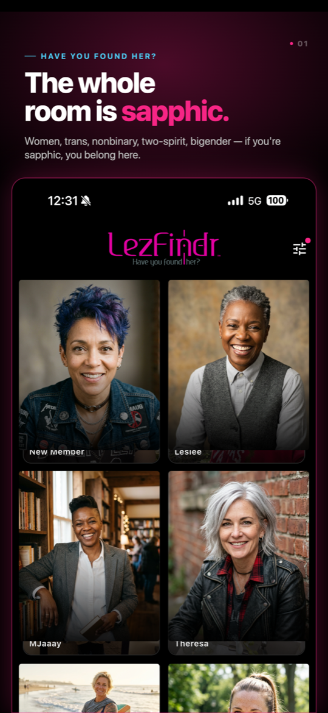
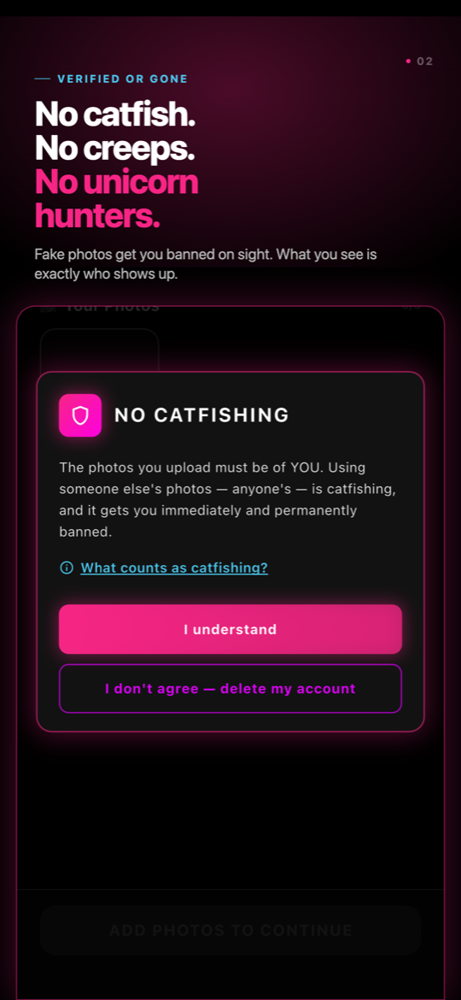
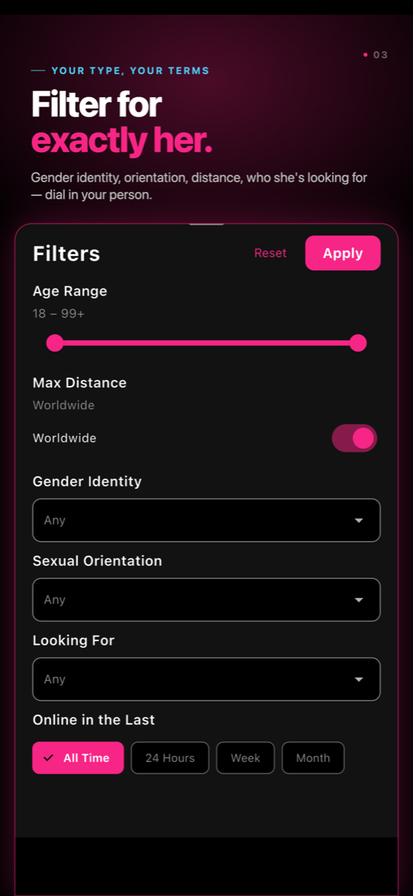
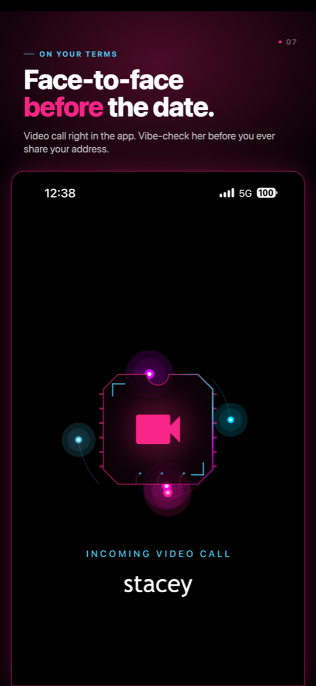
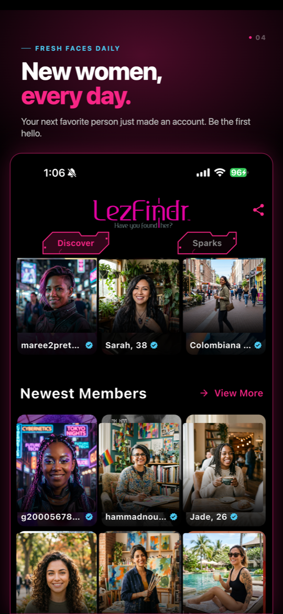
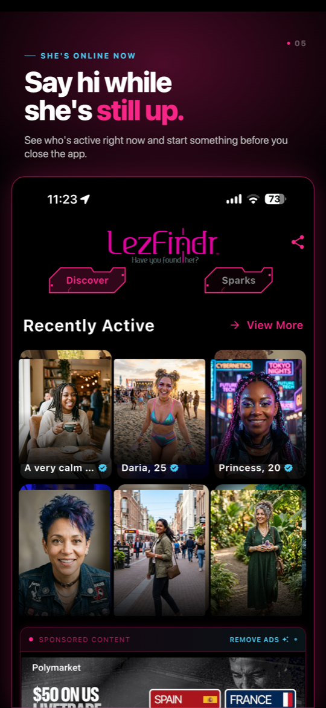
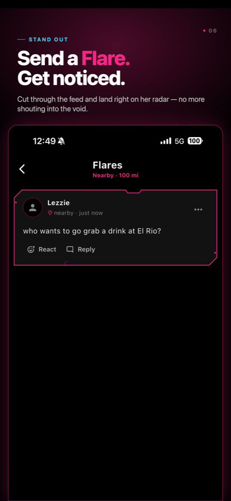
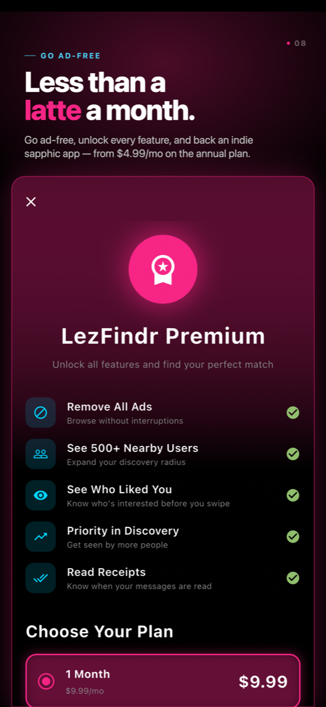
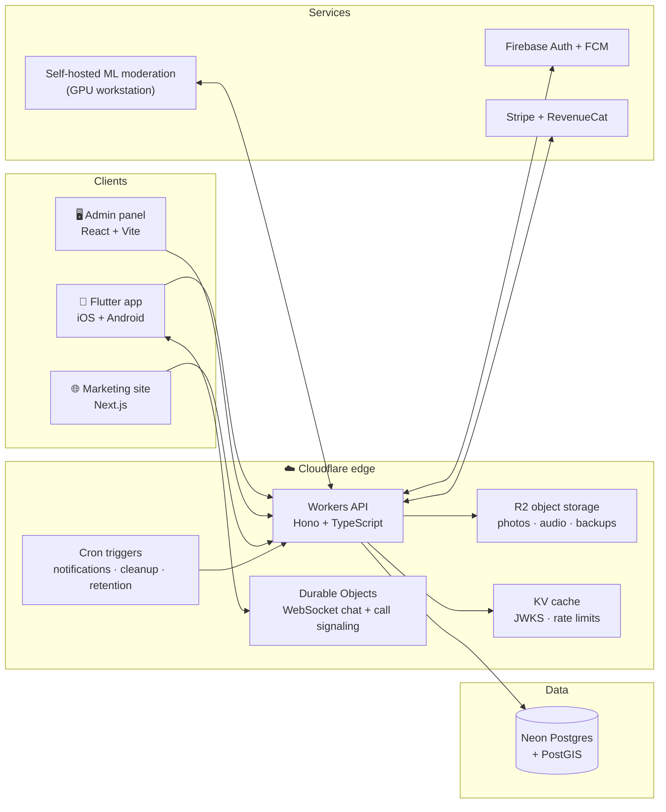

  
  <h1>LezFindr</h1>
  
<b>A community-centric dating and social app for lesbian, queer, and trans individuals.</b>

  
  

  
<a href="https://lezfindr.com">lezfindr.com</a>

---

## 📱 Project Overview

*Note: The source code for this application is proprietary and closed-source. This repository serves as an architectural overview and portfolio showcase.*

LezFindr is a fully realized, production-grade dating and social platform for sapphic women — live on both app stores, serving a global user base in **16 languages**, processing real payments, and moderated daily by a trust & safety pipeline built from scratch. I managed the entire product lifecycle — design, architecture, implementation, deployment, and ongoing operations — using a collaborative AI engineering workflow to execute the complete system as a solo engineer.

It's an indie alternative to the big dating apps: a "verified or gone" identity policy, location-based discovery, real-time chat with voice messages, in-app video & voice calling, a regional community board, events, and a business platform for LGBTQ+-friendly venues.

## 📸 Screenshots

| Discovery | Verification | Filters | Video Calls |
|:---:|:---:|:---:|:---:|
|  |  |  |  |

| New Members | Online Now | Flares | Premium |
|:---:|:---:|:---:|:---:|
|  |  |  |  |

**[Full app walkthrough →](docs/app-walkthrough.md)**

## 🏗️ System Architecture

Four deployed applications sharing one edge-first backend:

| Component | Stack | Role |
|---|---|---|
| **Mobile app** | Flutter · Dart · BLoC · go_router · get_it | iOS + Android — 26 feature modules, ~250k lines of Dart |
| **API** | Cloudflare Workers · Hono · TypeScript | 28 route modules, WebSocket chat via Durable Objects, WebRTC call signaling, scheduled jobs |
| **Database** | Neon Serverless Postgres · PostGIS | Geospatial discovery (`ST_DWithin` on `geography` columns), 54 versioned SQL migrations |
| **Media** | Cloudflare R2 | Photos, voice messages, DB backups — served from a custom CDN domain; a separate restricted sandbox bucket for moderation evidence preservation |
| **Admin panel** | React 18 · Vite · shadcn/ui · Capacitor | 25-page moderation & operations console, also builds as a native mobile app |
| **Website** | Next.js 16 · React 19 · Tailwind 4 | Marketing site + business onboarding on Vercel |
| **Auth** | Firebase Auth | JWTs verified at the edge via `jose` against Firebase JWKS (cached in KV); role claims for admin/business |
| **Payments** | RevenueCat + Stripe | App-store subscriptions, day passes, business billing, webhook-driven entitlements |
| **ML moderation** | Python · ArcFace · Whisper · ViT classifiers | Self-hosted trust & safety pipeline — [deep-dive](docs/trust-and-safety.md) |

## ✨ Engineering Highlights

- **🌍 Geospatial discovery at the edge** — distance-ranked profile feeds powered by PostGIS `geography` queries, served from Cloudflare's global edge network. [→ backend](docs/backend.md)
- **📞 P2P video & voice calling** — WebRTC 1:1 calls with a Durable Object signaling channel, a full call-state machine (ring, answer, decline, busy-lockout), and native incoming-call UX on both platforms. Voice calls reuse the same stack as an audio-only mode. [→ mobile app](docs/mobile-app.md)
- **💬 Real-time chat on Durable Objects** — one stateful WebSocket room per conversation, with typing indicators, read receipts, in-app voice messages stored in R2, and message-level moderation hooks. [→ backend](docs/backend.md)
- **🛡️ A trust & safety system that actually works** — liveness-checked photo verification with face matching (ArcFace, **0.991 AUC** on production data), tiered spam filtering, scam-corridor friction, human-in-the-loop review queues, and a self-hosted multi-model moderation engine. Measured finding: small specialized models beat general-purpose VLMs on both accuracy and cost. [→ trust & safety](docs/trust-and-safety.md)
- **🔄 A live Firebase → Postgres migration** — the platform started Firebase-everything and was migrated to Neon + Cloudflare Workers *while in production*, with ETL for Firestore→Postgres and Storage→R2, keeping Firebase only for auth and push. [→ architecture](docs/architecture.md)
- **🌐 16-language internationalization** — 2,100+ localized strings across 16 locales, RTL support included.
- **💰 Full monetization stack** — one premium tier, buyable day passes, rewarded ads, trial-expiry lifecycle, win-back offers — all entitlements resolved server-side so clients can never self-grant premium.
- **🧯 Operational maturity** — 3-2-1 database backups (PITR + nightly `pg_dump` to R2 + offsite), force-update gates via Remote Config, crash-driven release trains, structured log anomaly detection, and fleet version telemetry.

## 🔢 By the Numbers

| | |
|---|---|
| Lines of Dart (app) | ~250,000 |
| Lines of TypeScript (API) | ~23,500 |
| API route modules | 28 |
| Flutter feature modules | 26 |
| SQL migrations | 54 |
| Admin panel pages | 25 |
| Languages | 16 |
| Deployed applications | 4 |
| Engineers | **1** |

## 📚 Documentation

| Doc | What's inside |
|---|---|
| [Architecture](docs/architecture.md) | System design, the Firebase→Cloudflare migration story, key decisions, deployment topology |
| [Backend](docs/backend.md) | Workers API design, PostGIS discovery, Durable Objects chat & call signaling, cron jobs, payments, backups |
| [Mobile app](docs/mobile-app.md) | Flutter architecture, state management, WebRTC calling, i18n, release engineering |
| [Trust & safety](docs/trust-and-safety.md) | Verification pipeline, ML moderation engine, anti-scam systems, admin operations |
| [App walkthrough](docs/app-walkthrough.md) | Screen-by-screen tour of the product |

---

  Built and operated by <strong>Joshua Miller</strong> · <a href="https://lezfindr.com">lezfindr.com</a>

