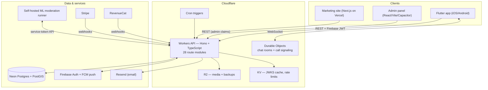

# Architecture

LezFindr is four deployed applications on one shared backend, run by a single engineer. Every architectural decision below was made under that constraint: the platform has to be operable, debuggable, and cheap enough for an indie product — while still handling real-time chat, video calls, geospatial search, payments, and content moderation for a global user base.

## System overview

## The migration story: Firebase → Postgres + Cloudflare, live

The platform launched Firebase-everything: Firestore for data, Cloud Functions for logic, Cloud Storage for media. That got a v1 shipped fast, but three walls appeared quickly:

1. **No relational queries.** A dating app is joins all the way down — "verified profiles within 40 km who liked me and aren't blocked" is painful and expensive in Firestore.
2. **No real geospatial support.** Geohash prefix tricks approximate radius search badly and can't rank by true distance.
3. **Cost scaling with reads**, which a swipe-heavy discovery feed generates in enormous volume.

The fix was a **phased live migration** with zero downtime:

- **Data → Neon Postgres.** Every Firestore collection got a relational schema with real foreign keys and indexes. One-off ETL scripts (kept in the repo as the historical record) streamed Firestore exports into Postgres.
- **Media → Cloudflare R2.** Photos and audio moved from Firebase Storage to R2 behind a custom CDN domain; zero egress fees changed the media cost curve entirely.
- **API → Cloudflare Workers.** All backend logic was rewritten as a Hono app running at the edge. Cloud Functions were retired incrementally as endpoints reached parity.
- **Auth stayed on Firebase** — deliberately. Rewriting authentication mid-flight was all risk and no reward. Instead, the Worker verifies Firebase ID tokens itself: it fetches Firebase's JWKS, caches it in KV, and validates JWT signature/issuer/audience on every request. Custom claims (`admin`, `business`) provide role-based access without another roundtrip.

The result is a hybrid that plays to each vendor's strength: Google's battle-tested auth + push, Cloudflare's edge compute + storage economics, and a real SQL database in between.

## Key design decisions

### Edge-first API
The entire API is a single Cloudflare Worker (Hono router, TypeScript, vitest for tests). No servers, no containers, no cold-start tuning, effectively free at indie scale, and deploys globally in seconds with `wrangler deploy`. Scheduled work (engagement notifications, data retention, subscription lifecycle) runs as cron triggers dispatched inside the same Worker — one deployable artifact for the whole backend.

### Stateful real-time via Durable Objects
Chat and call signaling need per-conversation state and ordered delivery — exactly what Durable Objects provide. Each conversation maps to a DO instance holding the live WebSocket connections; the Worker authenticates the upgrade request *before* forwarding to the DO, so the object itself never handles untrusted connections. The same signaling channel carries WebRTC offer/answer/ICE for video and voice calls.

### PostGIS for discovery
Profiles and businesses carry `geography(Point, 4326)` columns. Discovery feeds ("new & nearby", "recently active", event radius, regional community boards) are `ST_DWithin` queries with distance ranking — accurate, indexed, and one line of SQL instead of a geohash approximation layer.

### Server-side entitlements
Premium status is never trusted from the client. RevenueCat and Stripe webhooks write entitlements to Postgres; every gated endpoint checks the database. This closed a real vulnerability class (a client-writable premium flag found and fixed during a security pass).

### Human-in-the-loop moderation, ML-assisted
Machine learning flags; humans decide. A self-hosted ML runner (face matching, NSFW classification, voice transcription + classification, log anomaly detection) calls back into the API over service-token-authenticated endpoints and feeds review queues in the admin panel. Details in [trust & safety](trust-and-safety.md).

## Deployment topology

| App | Hosting | Deploy |
|---|---|---|
| API | Cloudflare Workers | `wrangler deploy` — seconds, global |
| Flutter app | App Store + Google Play | scripted builds; staged rollouts; force-update gate via Remote Config for retiring old builds |
| Admin panel | Netlify (+ Capacitor native shells) | git push → build |
| Website | Vercel | git push → build |

## Reliability & operations

- **Backups: 3-2-1.** Neon point-in-time recovery (7 days) + a protected long-lived branch + nightly `pg_dump` shipped to R2 with a 30-day lifecycle, plus offsite copies. A written restore runbook exists and has been exercised.
- **Observability.** Structured logging with an anomaly-detection loop that watches production logs and opens alerts on new error signatures; Crashlytics on mobile with crash-driven release trains; app-version telemetry in the database to track fleet adoption before flipping server-side behavior.
- **Safe rollout levers.** Server-driven feature flags and app settings let risky features (calls, spam thresholds, discovery rules) ship dark and turn on gradually; a Remote Config force-update gate hard-blocks abandoned builds.
- **The #1 operating rule:** never break the live app. Anything user-facing ships behind a flag or a staged rollout.
